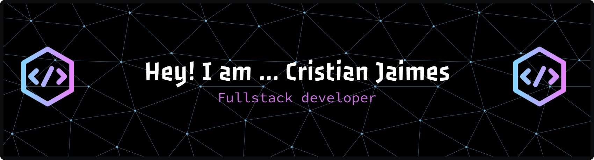

# 👋 Hi, I'm Cristian Jaimes

Telecommunications Engineering student passionate about software development and web technologies.

I am currently strengthening my Full Stack development skills, working with technologies such as:

* HTML5
* CSS3
* JavaScript
* Node.js
* Express.js
* SQL
* MariaDB
* MongoDB
* PostgreSQL
* Oracle APEX

# 📊 GitHub Stats:
  
   
 

---

<!-- Proudly created with GPRM ( https://gprm.itsvg.in ) -->

##  Featured Projects

### Reservation Management System

REST API developed with Node.js, Express, and PostgreSQL for managing laboratories, users, equipment, and reservations.

### Nexos Tour

Tourism agency website with a modern design, responsive approach, and optimized user experience.

##  Goals

* Obtain an opportunity as a Junior Developer or Software Development Intern.
* Build projects that demonstrate my technical skills.
* Continue learning new technologies and development methodologies.

##  Contact

* Email: [cristianjai2001@gmail.com](mailto:cristianjai2001@gmail.com)

---

⭐ Always open to learning, collaborating, and participating in new projects.
